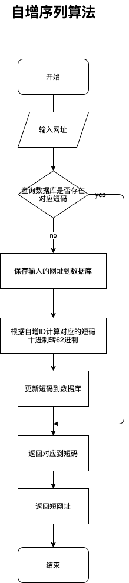

# Go短URL服务设计与实现

## 短URL的好处
* 破解短信、微博等平台字数的限制
* 短链更加友好简洁
* 方便统计URL的点击量
* 安全、不暴露访问参数

## 服务设计


## 服务实现
### 启动
```
go get -u github.com/convee/shorturl

cd $GOPATH/src/github.com/convee/shorturl

go build -o shorturl //构建

./shorturl  -addr 127.0.0.1:8002 //监听本地8002端口

```
### 生成短网址

```
curl http://127.0.0.1:8002/genUrl?url=https://convee.cn

```

- 成功：
```
{
    "error": 0,
    "msg": "ok",
    "data": {
        "url": "https://convee.cn",
        "short": "abc"
    }
}
```
- 失败：
```
{
    "error": 1,
    "msg": "no result",
    "data": null
}
```


### 根据短网址获取长网址

```
curl http://127.0.0.1:8002/getUrl?short=abc1

```

- 成功：
```
{
    "error": 0,
    "msg": "ok",
    "data": {
        "url": "https://convee.cn",
        "short": "abc"
    }
}
```
- 失败：
```
{
    "error": 1,
    "msg": "no result",
    "data": null
}
```

### 短网址302跳转
```
curl http://127.0.0.1:8002/abc1 

```
